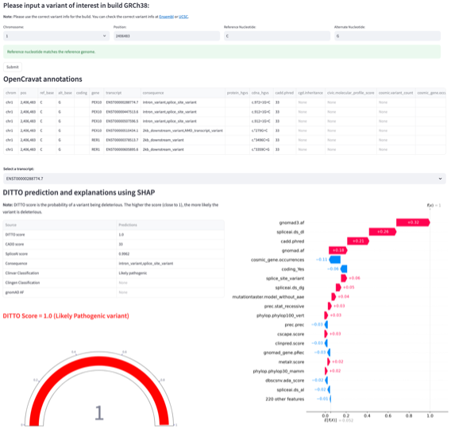

# DITTO

***!!! For research purposes only !!!***

> **_NOTE:_**  In a past life, DITTO used a different remote Git management provider, [UAB
> Gitlab](https://gitlab.rc.uab.edu/center-for-computational-genomics-and-data-science/sciops/ditto). It was migrated to
> Github in April 2023, and the Gitlab version has been archived.


**Aim:** We aim to develop a pipeline for accurate and rapid interpretation of genetic variants for pathogenicity using patient’s genotype (VCF) information.


## Usage

### Webapp

DITTO is available for public use at this [website](https://cgds-ditto.streamlit.app/). Here's an example on how it looks
like



### Setting up to use locally

> **_NOTE:_** Currently tested only in Cheaha (UAB HPC). Docker versions may need to be explored later to make it
> useable in Mac and Windows.

#### System Requirements

*Tools:*

- Anaconda3 or pip3
- OpenCravat
- Git

*Resources:*

- CPU: > 2
- Storage: ~1TB
- RAM: ~25GB for a WGS VCF sample

#### Installation

Requirements:

- DITTO repo from GitHub
- OpenCravat with databases to annotate
- Nextflow

To fetch DITTO source code, change in to directory of your choice and run:

```sh
git clone https://github.com/uab-cgds-worthey/DITTO.git
```

Create an environment via conda or pip. Below is an example to install `nextflow` and `OpenCravat` using `pipenv`:

- [Python virtual environment](https://docs.python.org/3/tutorial/venv.html)

```sh
# create environment. Needed only the first time. Please use the above link if you're not using Mac.
python -m venv ditto-env

source ditto-env/bin/activate

# Install nextflow and OpenCravat
pip install nextflow open-cravat
```


#### Setup OpenCravat (only one-time installation)

Please follow the steps mentioned in [install_openCravat.md](docs/install_openCravat.md).

> **_NOTE:_** Current version of OpenCravat that we're using doesn't support "Spanning or overlapping deletions"
> variants i.e. variants with `*` in `ALT Allele` column. More on these variants
> [here](https://gatk.broadinstitute.org/hc/en-us/articles/360035531912-Spanning-or-overlapping-deletions-allele-).
> These will be ignored when running the pipeline.


#### Run DITTO pipeline

Please make a samplesheet with VCF files (incl. path). Please make sure to edit the directory paths as needed.

```sh
nextflow run pipeline.nf \
  --outdir /data/ \
  -work-dir ./wor_dir \
  --build hg38 -with-report \
  --oc_modules /data/opencravat/modules \
  --sample_sheet .test_data/file_list_partaa
```

To run on UAB cheaha, please update the `model.job` file and submit a slurm job using the command below

```sh
sbatch model.job
```


## Reproducing the DITTO model

Detailed instructions on reproducing the model is explained in [build_DITTO.md](docs/build_DITTO.md)


## Contact information

For queries, send an email with clear description to

Tarun Mamidi    -   tmamidi@uab.edu
